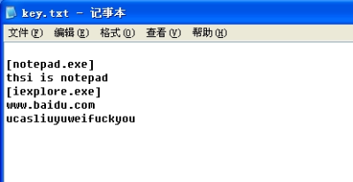
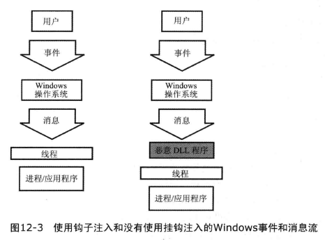
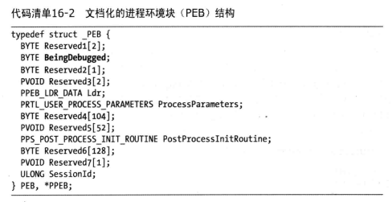
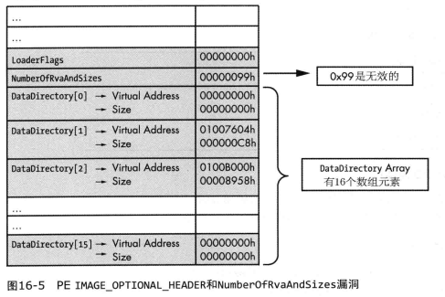
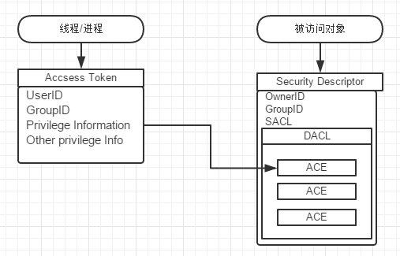
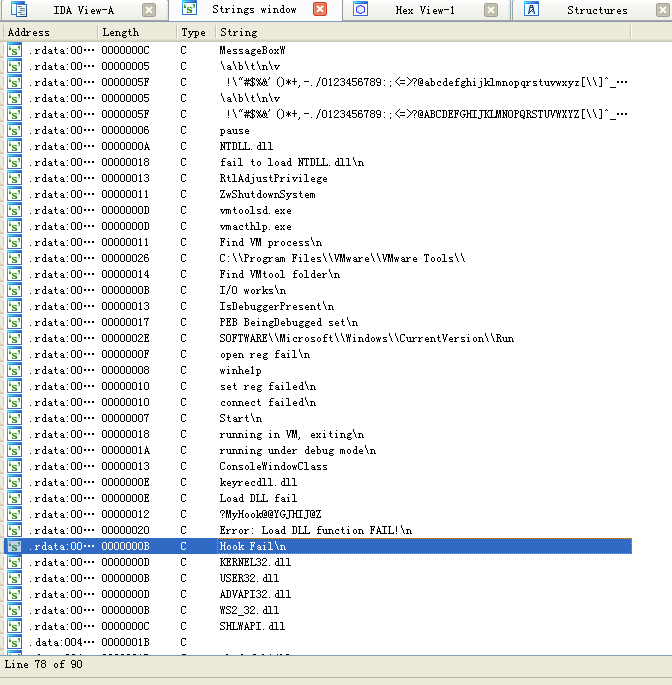
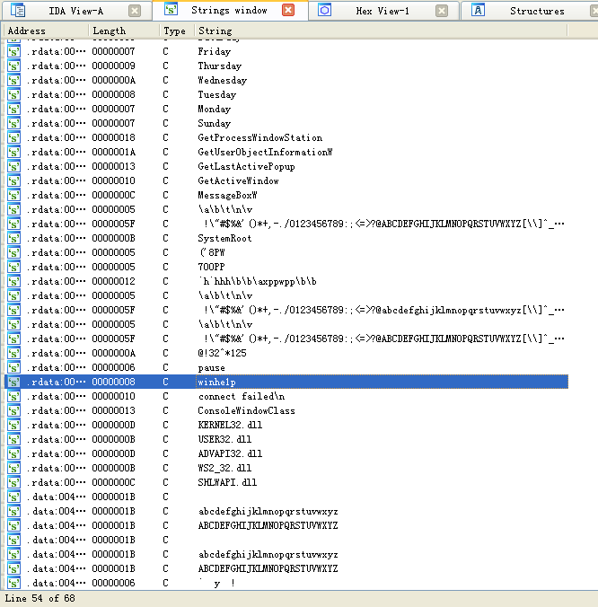

# 键盘钩子程序
一个带反虚拟机反调试的键盘钩子, 可以记录用户在哪个进程输入了什么内容, 检测到虚拟机或调试状态会立刻关机, 运行时会隐藏窗口  
dllmain.cpp 中有捕获键盘消息的存储位置  
[演示视频](https://github.com/Marsman1996/PoSS/issues/12)  
[程序下载](https://github.com/Marsman1996/PoSS/releases)  
  

## Details
### 键盘钩子原理
使用 *[SetWindowsHookEx](https://docs.microsoft.com/en-us/windows/desktop/api/winuser/nf-winuser-setwindowshookexa)(int idHook, HOOKPROC lpfn, HINSTANCE hmod, DWORD dwThreadId)* 函数捕获键盘消息  
  

| Parameters | 解释                                                                            |
| ---------- | ------------------------------------------------------------------------------- |
| idhook     | 钩子类型, 这里选择WH_KEYBOARD代表键盘钩子, 还有其他钩子类型可以看上面的MSDN文档 |
| lpfn       | 回调函数, 这里是 *keyrecdll.dll* 中的 *MyHook()*                                |
| hmod       | 回调函数所在DLL句柄                                                             |
| dwTHreadId | 钩子目标线程, 0代表全局钩子                                                     |

回调函数 *[MyHook](https://msdn.microsoft.com/en-us/library/windows/desktop/ms644984%28v=vs.85%29.aspx?f=255&MSPPError=-2147217396)(int code, WPARAM wParam, LPARAM lParam)* 中  

| Parameters | 解释                                                          |
| ---------- | ------------------------------------------------------------- |
| code       | 用于确定如何处理消息的代码                                    |
| wParam     | 虚拟键码, 详细见REFRENCE, 可用 *[ToAscii][1]()* 转化为ASCII码 |
| lParam     | 击键信息资料 这个数的31位(bit)为0表示键按下, 为1表示键释放    |

### 虚拟机检测
1. 查看当前运行的进程  
   使用 *[CreateToolhelp32Snapshot](https://docs.microsoft.com/zh-cn/windows/desktop/api/tlhelp32/nf-tlhelp32-createtoolhelp32snapshot)()* 函数得到系统进程快照的句柄, 轮询比对是否存在 *vmtoolsd.exe*, *vmacthlp.exe* 等虚拟机特有进程
2. 查看vmtool安装路径  
   使用 *[PathIsDirectory](https://docs.microsoft.com/zh-cn/windows/desktop/api/shlwapi/nf-shlwapi-pathisdirectorya)()* 函数查询是否存在虚拟机辅助工具安装目录 *C:\\Program Files\\VMware\\VMware Tools\\*
3. I/O通信端口:  
   VMware使用虚拟化的I/O端口完成宿主系统与虚拟机之间的通信, 以便支持诸如复制和粘贴功能. 这个端口可以被查询, 然后与 *VMXh* 比较, 以确定VMware的使用  
   ```
    __try{
        __asm{
            push   edx
            push   ecx
            push   ebx 
            mov    eax, 'VMXh'
            mov    ebx, 0   //用于存放VMware所有响应的内存地址
            mov    ecx, 0xa //获取VMware版本, 若为0x14则get the memory size
            mov    edx, 'VX'//为in指令指定VMware I/O通信端口
            in     eax, dx  //从源操作数指定的端口复制数据到目的操作数指定的内存地址
            cmp    ebx, 'VMXh' 
            setz   [is_VM] 
            mov    [VM_ver], ecx  //存储VMware版本, 1=Express, 2=ESX, 3=GSX, 4=WorkStation
            pop    ebx
            pop    ecx
            pop    edx
        }
    }
    __except(EXCEPTION_EXECUTE_HANDLER){ //若不在虚拟机中运行in指令会触发异常
        is_VM |= false;
    }
   ```

<details>
    <summary>废弃的方法: 别点开看了</summary>
    <p> 
        <s>查看MAC</s>: 真实机器上也会有VMware网卡 </br>
        <s>Red Pill</s>: 多核机器可能会出现问题 </br>
        <s>No Pill</s>: 没生效? </br> 
        <s>str</s>: 没生效?
    </p>
</details>

### 反调试
1. 调用Windows API: 
   *[IsDebuggerPresent](https://msdn.microsoft.com/en-us/library/windows/desktop/ms680345%28v=vs.85%29.aspx?f=255&MSPPError=-2147217396)()* 
    返回 1 代表处于调试状态
   (其实还有 *[CheckRemoteDebuggerPresent](https://msdn.microsoft.com/en-us/library/windows/desktop/ms679280(v=vs.85).aspx)()*, 
   *[NtQueryInformationProcess](https://docs.microsoft.com/en-us/windows/desktop/api/winternl/nf-winternl-ntqueryinformationprocess)()*, etc)  
2. 手动检测PEB(进程环境块)  
     
   检测PEB中的 *BeingDebugged* 标志位
3. 插入 *int 3* 中断:  
   运行 int 3指令时, 若处于非调试状态, 系统进入结构化异常处理(SEH), 在这里异常会被 `__except` 捕获程序得以正常运行, 若没有执行 `__except` 中的语句则说明程序处于调试状态  

<details>
    <summary>MMP书上骗我</summary>
    <p> 
        修改PE头: 只对OllyDBG 1.0x 有效  
        
    </p>
</details>

### 提权
这里使用的是 Windows token  
  
*RtlAdjustPrivilege(ULONG Privilege, BOOLEAN Enable, BOOLEAN CurrentThread, PBOOLEAN Enabled)* = 
*[OpenProcessToken](https://docs.microsoft.com/en-us/windows/desktop/api/processthreadsapi/nf-processthreadsapi-openprocesstoken)()* + 
*[LookupPrivilegeValue](https://docs.microsoft.com/en-us/windows/desktop/api/winbase/nf-winbase-lookupprivilegevaluea)()* + 
*[AdjustTokenPrivileges](https://docs.microsoft.com/en-us/windows/desktop/api/securitybaseapi/nf-securitybaseapi-adjusttokenprivileges)()*  
~~三合一显然划算很多啊~~  

| Parameters    | 意义                                             |
| ------------- | ------------------------------------------------ |
| Privilege     | 所需要的权限名称, 具体查下面REF                  |
| Enable        | True 打开权限, False 关闭权限                    |
| CurrentThread | True 仅提升当前线程权限, False提升整个进程的权限 |
| Enabled       | 输出原来相应权限的状态                           |

在这里我们获得 *SeShutdownPrivilege* 权限, 然后调用 *ZwShutdownSystem(SHUTDOWN_ACTION Action)* 快速关机
```
    enum SHUTDOWN_ACTION {
        ShutdownNoReboot,
        ShutdownReboot,
        ShutdownPowerOff
    }
```
### 永久驻留
通过 *[RegCreateKeyEx](https://docs.microsoft.com/en-us/windows/desktop/api/winreg/nf-winreg-regcreatekeyexa)()* 向 *HKEY_LOCAL_MACHINE\\SOFTWARE\\Microsoft\\Windows\\CurrentVersion\\Run* 加注册表实现开机自启  
再使用 *[ShowWindow](https://docs.microsoft.com/en-us/windows/desktop/api/winuser/nf-winuser-showwindow)(HWND hWnd, int nCmdShow)* 向 *nCmdShow* 传入 *SW_HIDE (0)* 参数 达到隐藏窗口以欺骗粗心的用户

<details>
    <summary>这也是废弃的方法: 别点开看了</summary>
    <p> 
        ~~添加服务?~~ In windows 7 service cannot interact with user desktop. So it is impossible. [ref](https://stackoverflow.com/questions/16665852/keyboard-hook-as-a-windows-service)
    </p>
</details>

### 远程控制
远程控制的原理是将套接字和cmd的标准流绑定. 演示使用两台Host-Only模式虚拟机, IP地址分别为192.168.166.128(控制端), 192.168.166.129(受控端), 其简要过程如下:  
1. 攻击者: 使用netcat创建一个服务, 本例使用端口6666.  
2. 受害者: 创建一个套接字, 并与控制端服务器建立连接. 之后绑定这个套接字与cmd.exe标准流(标准输入、标准输出以及标准错误). 调用 *[CreatProcess](https://docs.microsoft.com/zh-cn/windows/desktop/api/processthreadsapi/nf-processthreadsapi-createprocessa)()* 用隐藏窗口的方式创建cmd.exe程序, 对受害者隐藏cmd.exe进程.  
3. 攻击者: 此时可以看到受害者cmd命令行, 之后便可以进行命令行操作. 本例使用dir命令列出了受害者当前目录下的文件并打开notepad作为演示.

### 加密
使用 **多字节异或循环** 对字符串进行加密, 数学运算符为XOR(exclusive OR), 通常用"^"的符号表示.  
在二进制中若两个数相同取0, 不同取1.  
根据异或运算的特性, 当对某一字符串做异或操作时, 与之运算的字符串不同, 便可以得到不同的结果, 即可完成加密操作, 解密操作直接对密文进行同样的异或操作即可。  
在本部分实现对程序中敏感字符串的异或加密. 密钥为 *4@!32^*125*  
字符串加密前后数值见[issue9](https://github.com/Marsman1996/PoSS/issues/9)  
下图是IDA打开未加密和加密后的string窗口, 可以看到加密后IDA识别的string少了许多  
 

## Environment
虚拟机: Win XP SP3 + VS2010 + ANSI  
实机: Win 10 + VS2017 + ANSI

## REFERENCE
键盘钩子: 《恶意代码分析实战》CH12.4; [MSDN: Virtual-Key Codes](https://docs.microsoft.com/en-us/windows/desktop/inputdev/virtual-key-codes)  
虚拟机检测: 《恶意代码分析实战》CH17; Analysis of the Intel Pentium’s Ability to Support a Secure Virtual Machine Monit A virtual machine monitor; [Blog: 详解反虚拟机技术](https://blog.csdn.net/qq_32400847/article/details/52830990)  
反调试: 《恶意代码分析实战》CH15; [Blog: 详解反调试技术](https://blog.csdn.net/qq_32400847/article/details/52798050)  
提权: 《恶意代码分析实战》CH11.5; [Blog: Windows关机方法](https://www.cnblogs.com/archen1983/archive/2010/10/26/1861925.html); [Blog: 权限ID对照表](https://blog.csdn.net/zwfgdlc/article/details/52794551)  
永久驻留: 《恶意代码分析实战》CH11.4  
加密: 《恶意代码分析实战》CH13  
远程控制: 《恶意代码分析实战》CH11.2  


[1]: https://docs.microsoft.com/en-us/windows/desktop/api/winuser/nf-winuser-toascii "MSDN doc"
