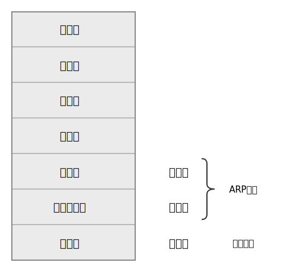
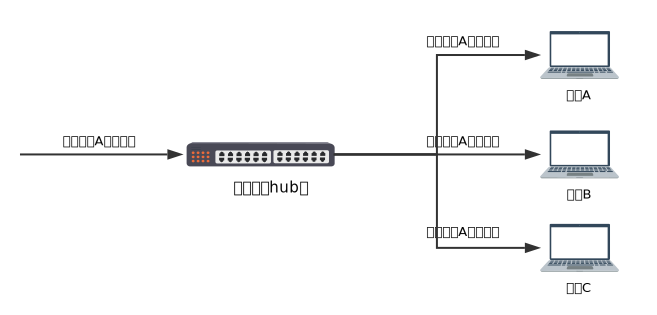
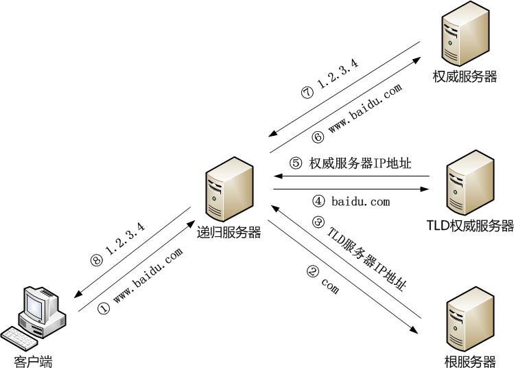
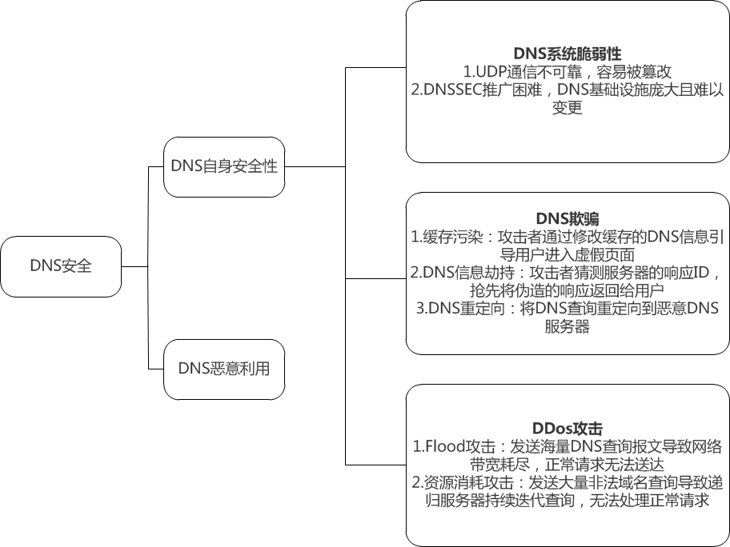
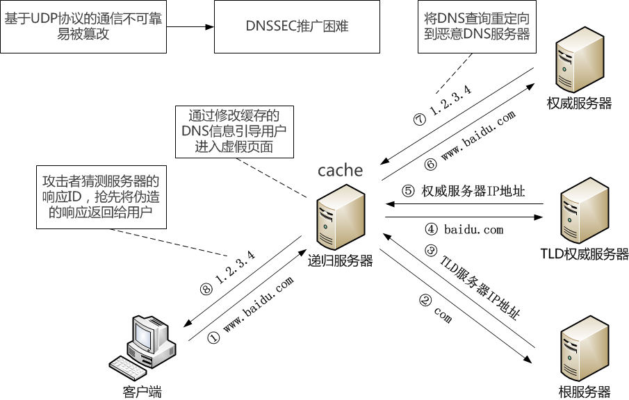

# 网络安全
## 网络如何工作
计算机互相连接构成计算机网络，该链接可以是有线连接方式例如拨号连接、光纤，也可以通过无线连接，例如wifi、数据网络等。  
主要通过 “包”的传递进行通信和交互，将数据等其它信息经过一层层协议的包裹进行发送，最终在目的地进行拆分组装。
## IP安全
### 数据嗅探的两种实现方式

#### OSI参考模型

#### 基于混杂模式的嗅探

对于有集线器的局域网环境，将网卡设置为混杂模式即可实现窃听局域网数据包。原理就是集线器工作在物理层，只负责广播数据包，也就是发往某个地址的数据包会被广播到整个局域网。正常情况下局域网电脑的网络接口会遵循一个“君子协定” -- 只接收目的地址是自己或者广播地址的数据包，其他情况则丢弃该数据包。而工作在混杂模式下的网卡会接收所有数据包，不论是不是发给自己的。

#### 基于arp欺骗的嗅探

交换机工作在数据链路层，所有与之相连的电脑都会被分配一个“端口”。交换机会将mac地址与端口做关联，这样发往某个地址的数据包会通过对应的端口直接发往目的主机，混杂模式就会失效。

arp投毒的原理就是当受害者与其他主机通信的时候，自己的arp缓存已经被恶意主机破坏，这时受害者做ip地址到mac地址转换的时候就会得到错误的mac地址，具体就是本来发往其他主机的数据包却发到了恶意主机。达到的效果就是恶意用户充当中间人，能够获取受害者与其他主机通信的数据内容。

### IP欺骗

#### 概念

> TCP/IP网络中的每一个数据包都包含源主机和目的主机的IP地址，攻击者通过伪造数据包，获得未被授权访问的信息，或者使伪造的信息被目的主机信任并接收。

#### 实现方法
- IP欺骗的主要表现形式有两种，一种是攻击者伪造的IP地址不可达或者根本不存在。另一种IP欺骗则着眼于目标主机和其它主机之间的信任关系。

1. 简单的ip地址

    > 攻击者伪造为受害主机ip与通信主机进行通信，

2. 源路由攻击

    > TCP/IP报头中的源路由选项明确指明了报文的传输路径，允许指定数据包发送后服务器返回的数据要通过的路由表，数据包发送者可以自己定义数据包头来伪装成信任主机，和目标机器信任连接。
    
3. Unix中的信任关系 **(补充)**

    >  在Unix系统中可以建立基于IP地址的信任关系，通过它可以使用R开头的远程调用命令，如；rlogin、rcall、rsh等，而无口令验证的烦恼。这中策略给攻击者提供了机会。

#### 防范方法 (补充)

1. 抛弃基于地址的信任策略，不允许R类远程调用命令的使用，删除rhosts文件；清空／etc／hosts．equic文件。这将使所有用户使用其它远程通信手段。

2. 进行包过滤：若网络是经路由器接入lnternet的那可以利用路由器来进行包过滤。确信只有内部LAN可以使用信任关系，而对于LAN以外的主机要慎重处理。路由器可以滤掉所有来自于外部而希望与内部建立连接的请求。

3. 使用随机化的初始序列号：攻击者之所以能够达到攻击目的，一个重要因素就是序列号不是随机选择的或随机增加的，所以，使用随机化的序列号能有效防止攻击。

__阻止IP欺骗的另一种明显的方法是在通信时进行加密传输和验证。加密和认证技术具体可分为IPsec和SSL，基于这它们可构建IPsec VPN和SSL__

1. IPSec   
    
> IPSec 提供了两种安全机制：认证和加密。认证机制使IP通信的数据接收方能够确认数据发送方的真实身份以及数据在传输过程中是否遭篡改。加密机制通过对据进行编码来保证数据的机密性，以防数据在传输过程中被窃听。
       
- AH协议定义了认证的应用方法，提供数据源认证和完整性保证；
- ESP协议定义了加密和可选认证的应用方法，提供可靠性保证。
- IKE协议用于密钥交换。
 
2. SSL
 
> SSL协议实现的安全机制包含：

- 传输数据的机密性：利用对称密钥算法对传输的数据进行加密。
- 身份验证机制：基于证书利用数字签名方法对server和client进行身份验证，当中client的身份验证是可选的。
- 消息完整性验证：消息传输过程中使用MAC算法来检验消息的完整性。

3. 适用范围
- IPSec适用于网对网的VPN连接（Site-Site），广泛应用于VPN路由器部署中。
- SSL比较适用于移动用户的远程接入（Client-Site），广泛应用于网络安全交易和远程控制。

#### 相关研究
- Systems and methods for ip source address spoof detection
- Towards a SDN-Based Integrated Architecture for Mitigating IP Spoofing Attack
- FHSD: An Improved IP Spoof Detection Method for Web DDoS Attacks
- 常用工具: nmap、hping、spoofer等

## DNS安全
### DNS介绍

DNS是一个大型的分布式数据库，
一次完整的DNS查询首先由客户端向递归服务器发送需要查询的域名，然后递归服务器向根服务器查询com TLD服务器的地址，通过返回的IP地址到com 的TLD服务器获取存储了baidu.com的权威服务器的IP地址，最后向权威服务器查询得到www.baidu.com的IP地址，并将结果缓存。

### DNS脆弱性
   
如图3所示，整个DNS查询过程都通过UDP协议通信，易被篡改。和IPSec、SSL一样，有组织提出DNSSEC加强DNS安全性，但没有大范围普及。

### DNS攻击形式
#### DNS欺骗
即给用户返回虚假的DNS响应。发生在服务器缓存阶段的欺骗叫做缓存投毒。这类攻击的一个典型例子是GFW，当递归服务器的DNS查询通过ISP流向国外权威服务器时，就会对该查询进行检测，若与黑名单匹配则伪装成该服务器发送虚假信息，从而污染递归服务器的缓存。(由于查询基于UDP协议，递归服务器只能接收最先到达的格式正确的信息，无法获取正确的地址)  
#### DNS信息劫持
发生在递归服务器返回响应时，攻击者猜测服务器的响应ID，抢先将伪造的响应返回给用户。  
#### DNS重定向
则可以发生在查询的各个阶段，攻击者通过将DNS查询重定向到恶意DNS服务器来返回伪造好的。
#### DDos攻击
详情见DoS部分
<!-- ### DDos攻击
比如Flood攻击：发送海量查询报文导致网络带宽耗尽，正常请求无法送达。以09年的6省断网事件为例，DNSPOD作为查询的中继节点受到攻击后关闭，此时暴风影音用户上亿的DNS查询无法解析而导致了递归服务器瘫痪。  
另一种威力巨大的是资源消耗攻击：通过发送大量不存在的域名查询导致递归服务器资源耗尽而无法处理正常请求。一个有趣的案例是2016年美国断网事件，攻击者利用Mirai僵尸感染大量物联网设备，并向DNS厂商发送无法解析域名的查询请求，导致正常用户的查询无法响应。   -->

### DNS恶意用途
#### DDOS攻击中的反射放大攻击
攻击者向DNS服务器发送大量查询，并将IP地址设置为目标主机的IP，通过响应使目标主机不可用  
#### 僵尸网络
黑客经常将域名作为C&C服务器和僵尸主机的通信媒介  
#### 钓鱼网站
攻击者注册与原域名相似的域名，并伪造页面，诱骗用户输入敏感信息 

## 传统DoS
**DoS**: 向目标发送大量信息使其崩溃的攻击方式  
**DDoS**: 进攻源不止一个的DoS
### SYN Flood攻击  

#### 实现原理
使用伪造的IP地址或者只进行三次握手协议中的第一次握手。因为SYN数据包用来打开一个TCP连接，所以受害者的机器会向伪造的地址发送一个SYN/ACK数据包作为回应，并等待预期的ACK响应。每个处于等待状态，半开的连接队列都将进入空间有限的待处理队列。此时将无法处理新的请求

#### 实现步骤

1. 需要安装的工具
    * Mininet
    * Netwox  `sudo apt-get install netwox`
    * openbsd-inetd  `sudo apt-get install openbsd-inetd`
    * telnetd  `sudo apt-get install telnetd`
2. 启动mininet创建带有1个路由器*s1*和3个终端*h1, h2, h3*的网络  `python setnet.py`  
   再为*h2*启动telnet  `sudo /etc/init.d/openbsd-inetd restart`
3. *h3*telnet链接*h2*验证正常状态下可以链接
4. *h1*使用netwox攻击*h2*  `sudo netwox 76 -i "10.0.0.2" -p "23"`

#### 结果观测
   *h1*向*h2*发动攻击后，*h3*无法再链接*h2*  
   使用wireshark发现大量SYN包  
   wireshark发现大量包传输行为  

或者视频？

#### 防御手段
开启SYN_COOKIES  
开启SYN_COOKIES后半开的连接队列并不会被分配实际的空间，而是根据这个SYN包计算出一个cookie值。在收到TCP ACK包时，TCP服务器在根据那个cookie值检查这个TCP ACK包的合法性。如果合法，再分配专门的数据区进行处理未来的TCP连接。  

#### REFERENCE
https://blog.csdn.net/sinat_26599509/article/details/51455350

### ACK FLOOD攻击
利用TCP三次握手第二次握手。目标主机每收到一个带有 ack标志位的数据包时，都会去自己的TCP连接表中查看有没有与ack的发送者建立连接，花费大量资源。
### CC(Challenge Collapsar)攻击
通过代理服务器或者大量“肉鸡” 模拟多个用户访问目标网站的动态页面，制造大量的后台数据库查询动作，消耗目标CPU资源，造成拒绝服务。
### UDP FLOOD攻击
数据包通过UDP发送时，所有的数据包在发送和接收时不需要进行握手验证。当大量UDP数据包发送给受害系统时，可能会导致带宽饱和从而使得合法服务无法请求访问受害系统。
## 新型DoS
### 反射型DDoS
攻击者并不直接攻击目标服务 IP，而是利用互联网的某些特殊服务开放的服务器，通过伪造被攻击者的 IP 地址、向有开放服务的服务器发送构造的请求报文，该服务器会将数倍于请求报文的回复数据发送到被攻击 IP，从而对后者间接形成 DDoS 攻击。 
常见的有NTP的monlist（listpeers也行）、DNS的AXFR（ANY也行）、SNMP的getbulkrequest。 
其中，NTP是网络时间协议（Network Time Protocol）的简称，通过网络协议使计算机之间的时间同步化。攻击者通过在请求中伪造源IP地址并请求NTP服务器的monlist列表来进行反射和放大。[2014年](https://blog.cloudflare.com/technical-details-behind-a-400gbps-ntp-amplification-ddos-attack/ "NTP attack")著名网络服务提供商Cloudflare就遭受了以NTP作为DDoS放大器的攻击。  
<!-- 今年2月28日github就遭受了[基于UDP的memcached流量DDoS攻击](https://githubengineering.com/ddos-incident-report/ "ddos-incident-report")也是一种反射型DDoS攻击。   -->
### websocket DDoS
websocket是HTML5一种新的协议。它实现了浏览器与服务器全双工通信(full-duple)。目前主流的浏览器都能很好地支持websocket，而且用它实现DoS攻击也并不是很难，只要是在js代码中写入相应的代码，当人们打开这个网页时浏览器会自动执行js代码去请求连接要攻击的IP地址。
## DoS防御
* 增加每次连接时的开销：如连接所需时间
    * 但是对DDoS无效
* ISP端过滤(流量清洗)：清洗是指将流量从原始网络路径中重定向到清洗设备上，通过清洗设备对该IP的流量成分进行正常和异常判断，丢弃异常流量，并对最终到达服务器的流量实施限流，减缓攻击对服务器造成的损害   今年2月28日github遭受[DDoS攻击](https://githubengineering.com/ddos-incident-report/ "ddos-incident-report")时便是向Akamai请求协助接管流量。
    * 使网络带宽明显下降
* 交换机和路由器拒绝转发伪造的数据包
    * 对现有协议做出较大改变

## 网络安全的未来
### 网络威胁发展趋势
1. 网络攻击与物理攻击结合；
2. 人工智能恶意软件放大攻击者的能力（因为它是基于AI的，所以这种新型恶意软件将能够从其环境中学习，分析应用程序和系统以实时发现和利用新的漏洞。在这种情况下，很难区分哪些是安全的，能够免受未经授权的访问影响，而哪些是不安全的。即使以前被认为受到良好保护的信息也有可能会受到损害）
3. 针对联网车辆及家居的攻击数量剧增（如果这些电器受到攻击者操纵，同切被切换为“全功率”（full power）模式，将会产生意想不到的功率需求，最终造成电力过载并导致地区电网不能正常运行。随着电网宕机或严重退化，组织的能力将被削弱并难以发挥作用。）
4. 网络安全人员成泄露组织机密（内部威胁一直很重要，稍一出错就可能使整个组织陷入危险境地。漏洞悬赏和道德披露计划的建立，加上网络犯罪或黑客对于机密信息的需求，都促使漏洞信息的价值不断攀升。）
### 应对措施
1. 加强《网络安全法》的完善与实施，国与国直接进行合作保护网络空间的安全；
2. 培养网络安全的专业人才，提高法律和到的修养。
3. 加强身份认证技术：随着越来越多用户访问远程或者云端资源和越来越多的物联网设备，身份已经成为当前最主要的攻击对象。
4. 采用安全的协议，例如Https全面替代Http。
5. 对于入侵检测、漏洞挖掘和修补等领域，加强与人工智能领域的合作，只有借助机器自动化秒级的响应速度才能控制网络安全威胁。

***

## Credits
[Marsman1996](https://github.com/Marsman1996) 
[n3vv](https://github.com/n3vv) 
[Smilencelsy](https://github.com/Smilencelsy) 
[Henry3II](https://github.com/Henry3II) 
[liupuz](https://github.com/liupuz) 
[liuweiqi18](https://github.com/liuweiqi18) 
[qdtjvszxc](https://github.com/qdtjvszxc) 
[BlackDiamond1995](https://github.com/BlackDiamond1995) 
[soleil](https://github.com/solei1) 
