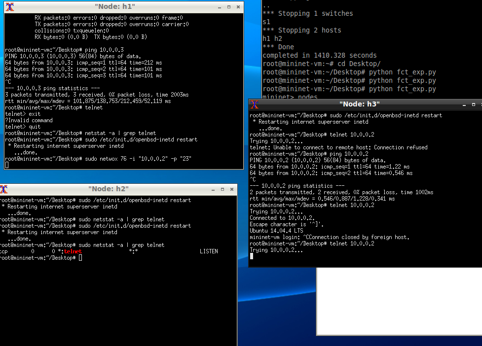
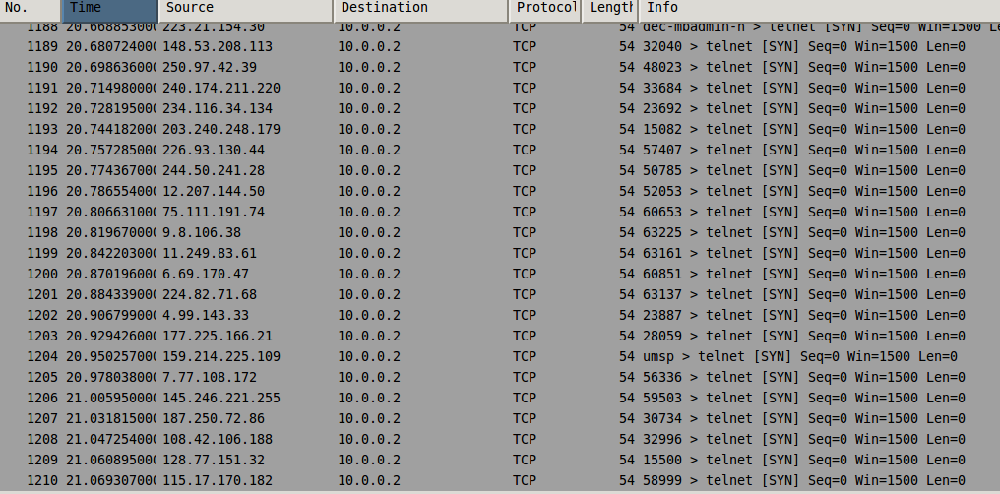
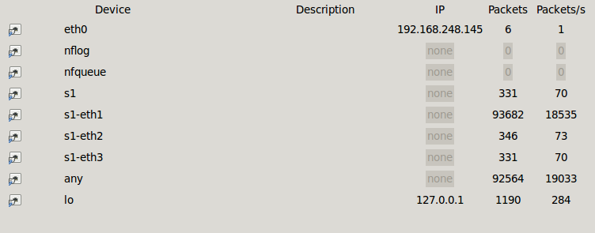

# 网络安全
## IP安全

## DNS安全

## 传统DoS
**DoS**: 向目标发送大量信息使其崩溃的攻击方式  
**DDoS**: 进攻源不止一个的DoS
### SYN Flood攻击  

#### 实现原理
使用伪造的IP地址或者只进行三次握手协议中的第一次握手。因为SYN数据包用来打开一个TCP连接，所以受害者的机器会向伪造的地址发送一个SYN/ACK数据包作为回应，并等待预期的ACK响应。每个处于等待状态，半开的连接队列都将进入空间有限的待处理队列。此时将无法处理新的请求

#### 实现步骤

1. 需要安装的工具
    * Mininet
    * Netwox  `sudo apt-get install netwox`
    * openbsd-inetd  `sudo apt-get install openbsd-inetd`
    * telnetd  `sudo apt-get install telnetd`
2. 启动mininet创建带有1个路由器*s1*和3个终端*h1, h2, h3*的网络  `python setnet.py`  
   再为*h2*启动telnet  `sudo /etc/init.d/openbsd-inetd restart`
3. *h3*telnet链接*h2*验证正常状态下可以链接
4. *h1*使用netwox攻击*h2*  `sudo netwox 76 -i "10.0.0.2" -p "23"`

#### 结果观测
   *h1*向*h2*发动攻击后，*h3*无法再链接*h2*  
   使用wireshark发现大量SYN包  
   wireshark发现大量包传输行为  

或者视频？

#### 防御手段
开启SYN_COOKIES  
开启SYN_COOKIES后半开的连接队列并不会被分配实际的空间，而是根据这个SYN包计算出一个cookie值。在收到TCP ACK包时，TCP服务器在根据那个cookie值检查这个TCP ACK包的合法性。如果合法，再分配专门的数据区进行处理未来的TCP连接。  

#### REFERENCE
https://blog.csdn.net/sinat_26599509/article/details/51455350

### ACK FLOOD攻击

### CC(Challenge Collapsar)攻击

### UDP FLOOD攻击

## 新型DoS

### 反射型DDoS

### websocket DDoS

## DoS防御

## Credits
[Marsman1996](https://github.com/Marsman1996) 